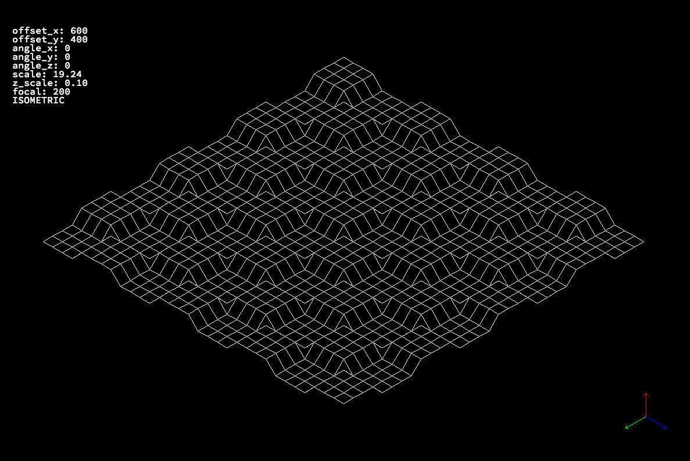
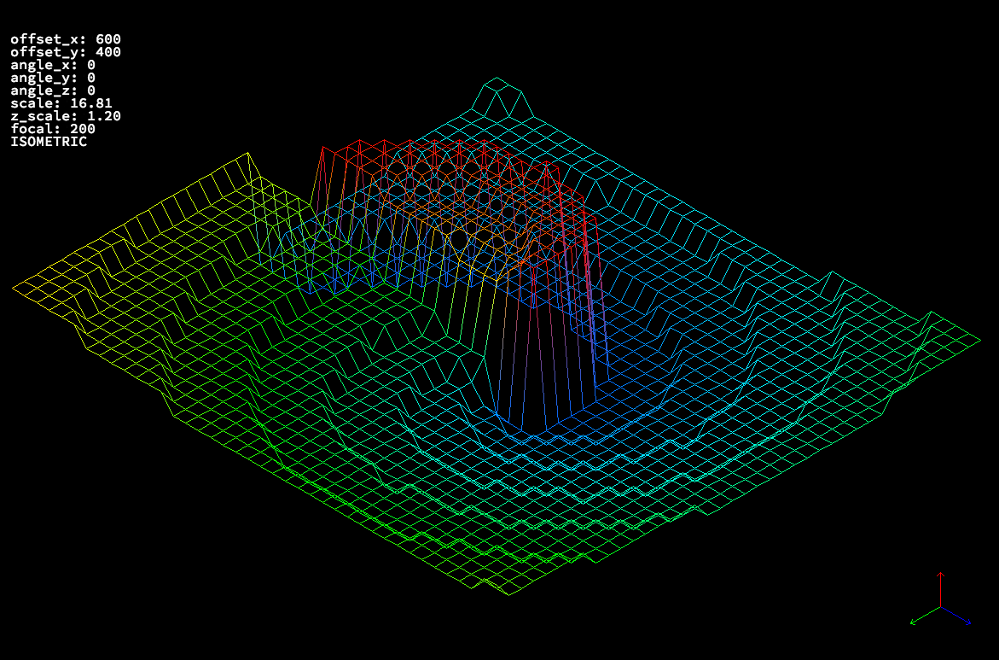
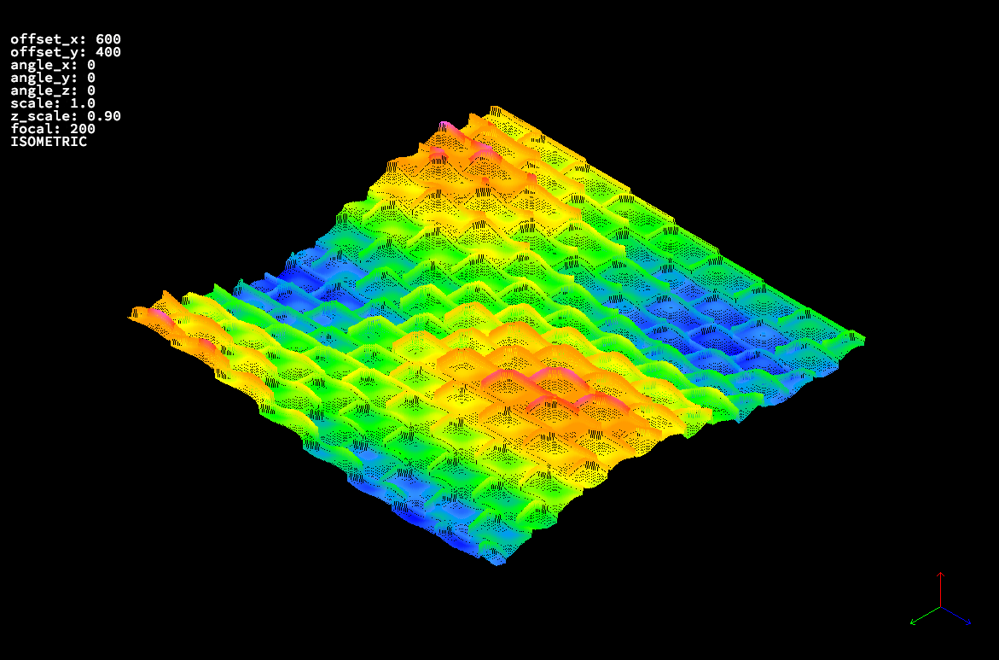
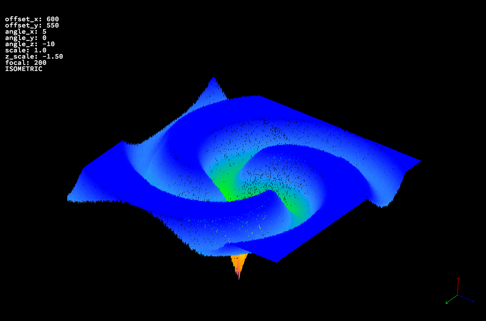
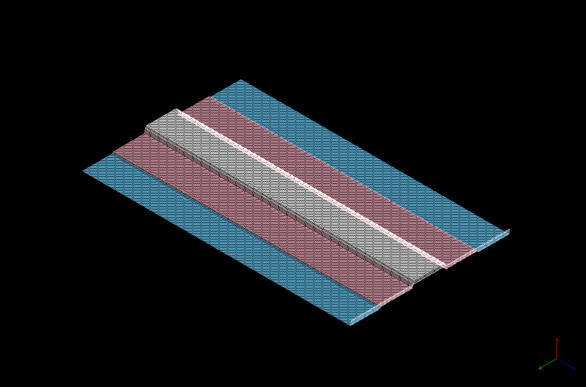

## FDF (Fil de Fer / Wireframe)

FDF (Fil de Fer, meaning "Iron Wire" or **Wireframe**) is a project that renders a **landscape wireframe in 2.5D** from elevation data (in the `.fdf` format), utilizing techniques of **linear transformation**, **projection**, and **line rasterization**. Developed with passion and dedication, FDF transforms pixels into 3D shapes!

-----
## 🖼️ Visual Showcase

The following examples demonstrate FDF's rendering capabilities, color interpolation, and bonus features.







-----

## 🖥️ Installation and Execution

To run the project locally, the **MLX42** library and its dependencies must be properly set up on your system.

### 1\. Install Dependencies

You must install the following libraries required by MLX42 (e.g., on Debian/Ubuntu):

```bash
sudo apt install build-essential cmake libglfw3-dev libglew-dev libglu1-mesa-dev libxrandr-dev libxinerama-dev libxcursor-dev libxi-dev
```

### 2\. Clone and Initialize Submodules

The **MLX42** library is included as a Git Submodule. Use the `--recurse-submodules` flag to clone the repository and automatically initialize and update the submodule:

```bash
git clone --recurse-submodules https://github.com/Talen400/42_fdf.git
cd 42_fdf
```

### 3\. Compile the Program

You can compile the standard version or the bonus version (which includes rotation and perspective features):

  * **Standard Version:**
    ```bash
    make
    ```
  * **Bonus Version:**
    ```bash
    make bonus
    ```

### 4\. Execute

The program expects a compiled binary (`fdf` or `fdf_bonus`) and an `.fdf` map file as an argument.

  * **Example (Standard):**
    ```bash
    ./fdf <path/to/the/file.fdf>
    ```

-----

## 👤 Author

**tlavared** - 42 São Paulo


*Made with ❤️ at 42 São Paulo*
